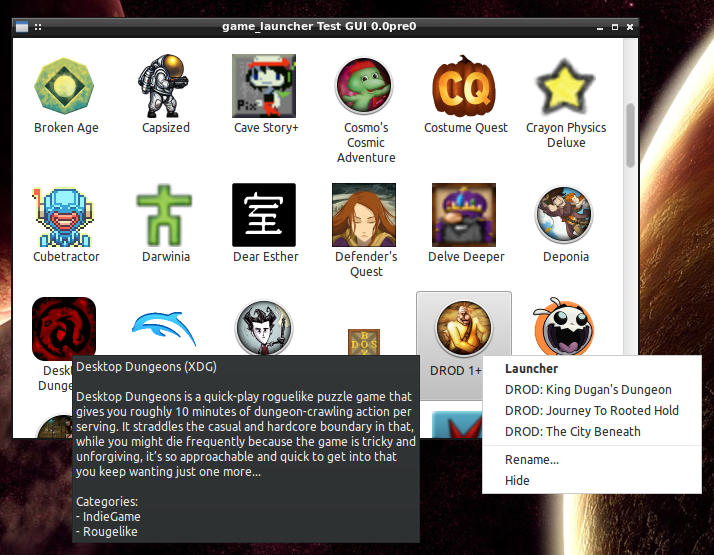

# Experiment in Steam-less Game Launching

**WARNING:** This project doesn't yet have a permanent name, so this URL
    isn't permanent. I merely uploaded this on request.

This is a very Work-In-Progress experiment in how far I can go to produce
something Steam-like for DRM-free games without depending on an external
service.

Currently, its primary focus is on getting the game provider backends
complete, comprehensive, and reliable, so this is what the test GUI looks like:

(The blurry Crayon Physics and Delve Deeper icons will be fixed when I bypass
the scaled icon caches used by PlayOnLinux and the Desura client and read
straight from the source files. The undersized DOSBox icon issue is already
fixed.)

At the moment, it supports the following backends:

* [XDG .desktop files](http://standards.freedesktop.org/desktop-entry-spec/latest/)
  installed into the [launcher system](http://standards.freedesktop.org/menu-spec/menu-spec-latest.html)
* The [Desura](http://desura.com/) client when using `~/.desura/`
* Windows applications via [PlayOnLinux](http://playonlinux.com/)
* A fallback option which can use (in descending priority order):

    * Metadata scraped from GOG.com's `start.sh` scripts
    * Metadata scraped from my
      [`install.sh`](https://gist.github.com/ssokolow/7010485) script
    * Names, icons, and executables heuristically inferred from filesystem paths
      (eg. `trine2_complete_story_v2_01_build_425_humble_linux` becomes "Trine
2: Complete Story")

**NOTE:** Currently, it preserves no state. While the "Rename..." and "Hide"
options in the test GUI do work, they won't be remembered across restarts.

## Dependencies

* A POSIX-compliant operating system
* [PyXDG](https://pypi.python.org/pypi/pyxdg)
* One of...

  * Python 2.7, [PyGTK](http://packages.ubuntu.com/trusty/python-gtk2),
    and [enum34](https://pypi.python.org/pypi/enum34)
    (For the more advanced test GUI, since it's what I'm used to and I don't
    like GTK+ 3.x)
  * Python 3.4 and [PyQt5](http://www.riverbankcomputing.com/software/pyqt/download5)
    (For the test GUI which may form the base for something permanent)

If you want to run the test suite, you'll also need:
* [Nose](https://pypi.python.org/pypi/nose)
* [coverage](https://pypi.python.org/pypi/coverage)

**NOTE:** Until I decide on a permanent name, I can't produce an installable
package name and, thus, can't test in a virtualenv with tox. As such, I can't
 guarantee my list of required dependencies is complete.

Also, the test suite doesn't yet exercise the code branches for things like
"PlayOnLinux not found".

## Usage

1. Edit the `GAMES_DIRS` constant in `src/game_providers/fallback/__init__.py`
2. Run one of the following:

   * `test_providers.py` for a quick, bare test of what the backends find
   * `testgui.py` for the GTK+ 2.x test GUI which exercises the full range of
     functionality currently implemented.
   * `testgui_qt.py` for the Qt5 test GUI which I'm using to drive frontend
     agnostic refactoring and to identify warts in a Qt implementation.
   * `nosetests` to run the test suite

## Ideas (Incomplete)

1. Support for moving things with backends like PlayOnLinux and Desura/Desurium
   out of the list of games (where the XDG backend put them) and into either
   the context menu for the things they provided or a menu bar.
1. Backends for [ScummVM](http://scummvm.org/),
   [ResidualVM](http://residualvm.org/), and anything else I use which can be
   both reliably scraped and launched directly into a specific game.
1. Look into merging with [Lutris](https://lutris.net/). They've got a GUI and
   plans for more backends. I'm writing more backends and may be satisfied with
   their GUI.
1. Tagging/Categorization, filtering, and sorting
1. Joystick activity proxying for reliable screensaver suppression
1. Play time tracking incorporating
   [input idle-based](https://coderrr.wordpress.com/2008/04/20/getting-idle-time-in-unix/)
   AFK detection
1. [Antimicro](https://github.com/Ryochan7/antimicro) integration, if possible
1. Support for taking a "local GOG backups" folder and providing a Steam-like
   ability to batch-select and install .deb and/or .tar.gz games from it.
   (At minimum as a proof of concept.
   [LGOGDownloader](https://github.com/Sude-/lgogdownloader) integration later, maybe.)
1. [LD_PRELOAD](http://www.linuxjournal.com/article/7795)
   [[1]](http://www.catonmat.net/blog/simple-ld-preload-tutorial/)
   [[2]](http://www.catonmat.net/blog/simple-ld-preload-tutorial-part-2/)
   hooks to do things like:

  * Wrapping X11 APIs to change resolution and create new windows so that games
    can be forced to windowed operation without realizing it.
    (Especially under LXDE since Openbox is terrible about remembering window
    positions and I dread launching new games because they might default to
    fullscreen operation and trash my desktop layout)
  * Wrapping POSIX APIs like [`getpwnam`](http://linux.die.net/man/3/getpwnam)
    to force games like Draw a Stickman and Wizorb to write their non-hidden
    folders somewhere other than `$HOME` even if they ignore `$HOME`.
  * Wrapping SDL calls so games like Dungeons of Dredmor will still offer
    sane windowed-mode resolutions if the nVidia TwinView
    [`MetaModes`](https://help.ubuntu.com/community/VideoDriverHowto#Twin_View_or_Dual_Head_displays)
    option is used to lock the desktop at 2560x1024.
  * Lying to games about the available set of joysticks to...

    * ...prevent games like Wizorb from crashing with more than 4 joysticks
      connected.
    * ...provide [joystick selection](https://imgur.com/sJeiCFK) for games like
      Rogue Legacy which insist on using joystick #1, despite Linux having no
      Joystick Control Panel to mark your 3DConnexion Space Navigator's dud
      joystick endpoint (it's
      [not a joystick at all](http://www.3dconnexion.com/products/spacemouse/spacenavigator.html))
      as non-default.
    * Redirect games which prefer evdev over joydev through some kind of
      [uinput](http://who-t.blogspot.ca/2013/09/libevdev-creating-uinput-devices.html)-
      or [CUSE](http://bryanpendleton.blogspot.ca/2011/02/fuse-cuse-and-uio.html)-based
      proxy to reverse the deprecation of the ability to calibrate devices with
      broken defaults like the Saitek Cyborg 3D USB Gold (currently useless in
      Strike Suit Zero).

1. Possibly [XMPP](https://en.wikipedia.org/wiki/Xmpp#Deployments) integration
   for a Steam chat analogue.
1. Matchmaking for DOSBox's IPX tunneling if I can figure out how to do it
   well.

...and various other things not yet copied out of my TODOs
