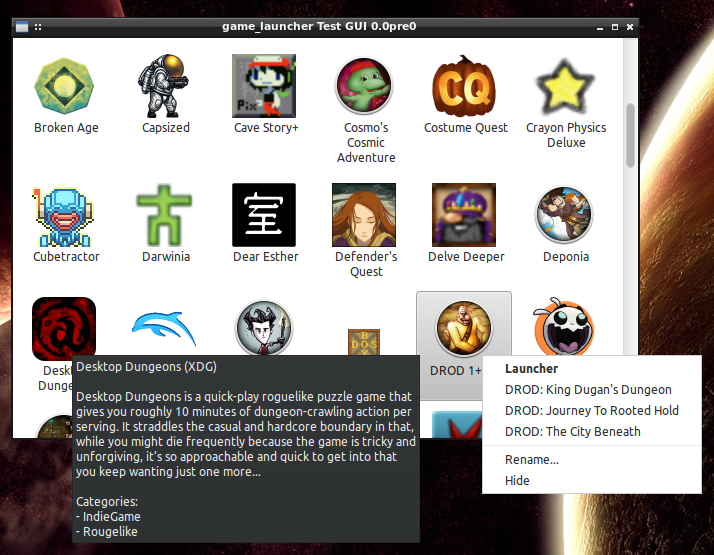

=======================================
Experiment in Steam-less Game Launching
=======================================

**WARNING:** This project doesn't yet have a permanent name, so this URL isn't
permanent. I merely uploaded this on request.

This is a very Work-In-Progress experiment in how far I can go to produce
something Steam-like for DRM-free games without depending on an external
service.

Currently, its primary focus is on getting the game provider backends
complete, comprehensive, and reliable, so this is what the test GUI looks like:

(The blurry Crayon Physics and Delve Deeper icons will be fixed when I bypass
the scaled icon caches used by PlayOnLinux and the Desura client and read
straight from the source files. The undersized DOSBox icon issue is already
fixed.)

At the moment, it supports the following backends:

* `XDG .desktop files`_ installed into the `system launcher`_
* The Desura_ client when using ``~/.desura/``
* Games configured in a system-wide install of ScummVM_ or ResidualVM_.
* Windows applications via PlayOnLinux_
* A fallback option which can use (in descending priority order):

  * Metadata scraped from GOG.com's ``start.sh`` scripts
  * Metadata scraped from my `install.sh`_ script
  * Names, icons, and executables heuristically inferred from filesystem
    paths (eg. ``trine2_complete_story_v2_01_build_425_humble_linux``
    becomes "Trine 2: Complete Story")

.. _Desura: http://desura.com/
.. _install.sh: https://gist.github.com/ssokolow/7010485
.. _PlayOnLinux: http://playonlinux.com/
.. _ResidualVM: http://residualvm.org/
.. _ScummVM: http://scummvm.org/
.. _system launcher: http://standards.freedesktop.org/menu-spec/menu-spec-latest.html
.. _XDG .desktop files: http://standards.freedesktop.org/desktop-entry-spec/latest/

**NOTE:** Currently, it preserves no state. While the "Rename..." and "Hide"
options in the test GUI do work, they won't be remembered across restarts.

Dependencies
============

* A POSIX-compliant operating system (eg. Linux)
* PyXDG_
* One of...

  * Python 2.7, `PyGTK 2.x`_, and enum34_ (For the more advanced test GUI,
    since it's what I'm used to and I don't like GTK+ 3.x)
  * Python 3.4 and PyQt5_ (For the test GUI which may form the base for
    something permanent)

If you want to run the test suite, you'll also need:

* Nose_
* coverage.py_

.. _coverage.py: https://pypi.python.org/pypi/coverage
.. _enum34: https://pypi.python.org/pypi/enum34
.. _Nose: https://pypi.python.org/pypi/nose
.. _PyGTK 2.x: http://packages.ubuntu.com/trusty/python-gtk2
.. _PyQt5: http://www.riverbankcomputing.com/software/pyqt/download5
.. _PyXDG: https://pypi.python.org/pypi/pyxdg

**NOTE** Until I decide on a permanent name, I can't produce an installable
package name and, thus, can't test in a virtualenv with tox. As such, I can't
guarantee my list of required dependencies is complete.

Also, the test suite doesn't yet exercise the code branches for things like
"PlayOnLinux not found".

Usage
=====

#. Edit the ``GAMES_DIRS`` constant in
   ``src/game_providers/fallback/__init__.py``
#. Run one of the following:

   * ``test_providers.py`` for a quick, bare test of what the backends find
   * ``testgui.py`` for the GTK+ 2.x test GUI which exercises the full range of
     functionality currently implemented.
   * ``testgui_qt.py`` for the Qt5 test GUI which I'm using to drive frontend
     agnostic refactoring and to identify warts in a Qt implementation.
   * ``nosetests`` to run the test suite

Ideas (Incomplete)
==================

#. Debug logging for anything eliminated from consideration when gathering the
   game list and why. (eg. ``TryExec`` failed, eliminated by deduplication,
   etc.)
#. Look into merging with Lutris_. They've got a GUI and plans for more
   backends. I'm writing more backends and may be satisfied with their GUI.

.. _Lutris: https://lutris.net/

Ideas: Data Model
-----------------

#. Support for moving things like PlayOnLinux, Desura/Desurium, ScummVM, and
   ResidualVM out of the list of games (where the XDG backend put them) and
   into either the context menu for the things their game_providers returned
   or a menu bar.
#. Some kind of automated "install.sh 'GAME_ID' *or* key generated-from-name
   *or* path *or* ..." matching combined with not flushing SQLite records on
   uninstall to allow custom settings to persist should the user ever
   reinstall a game.
#. Support for taking a "local GOG backups" folder and providing a Steam-like
   ability to batch-select and install .deb and/or .tar.gz games from it.
   (At minimum as a proof of concept. LGOGDownloader_ integration later,
   maybe.)
#. Tagging/Categorization, filtering, and sorting

   * Unlike Steam, make this a proper tagging system and allow multiple tags to
     be applied and filtered by at once.
     `[1] <http://stackoverflow.com/q/3826552/435253>`__
     `[2] <http://stackoverflow.com/q/2182774/435253>`__
     `[3] <https://www.sqlite.org/cvstrac/wiki?p=PerformanceTuning>`__
   * Probably a good idea to allow the user to define custom axes and assign
     tags to them so nice editing and filtering UIs can be auto-generated.
#. Some kind of easy mechanism for allowing user-specified "saved query" filters
   (both scalar and vector) such as "What haven't I played recently?" and "Pick
   me something at random".

.. _LGOGDownloader: https://github.com/Sude-/lgogdownloader

Ideas: Global Workarounds for Broken Desktops
---------------------------------------------

#. Save and restore gamma profiles so that buggy games won't leave the desktop
   messed up and games without custom gamma support can be forced to have
   custom gamma by editing the gamma in another window while the game is
   running (either using ``xgamma`` or the X calls it makes).
#. Unified suspension of the screensaver because it looks like nobody's going
   to properly fix "Screensaver activation ignores Joystick input" until at
   least when Wayland replaces X.org.

   * Look into the best way to accomplish portable screensaver suspension and
     whether it would allow me to resume the screensaver when AFK is detected.

Ideas: Per-game Workarounds for Broken Games
--------------------------------------------

#. Look into ways to make "separate out save/config/log files for backup using
   OverlayFS" a more officially supported option, given that it's been in
   Ubuntu kernels since 11.10 and was mainlined in 3.18.
#. Checkbox to automatically wrap joysticks via xboxdrv_ (Linux) or x360ce_
   (Windows) for games like Towerfall Ascension which only recognize XBox 360
   controllers and need other joysticks to lie about their identity.
#. Option to specify an Antimicro_ profile to automatically load so joystick
   can be transparently added to games like Cave Story+ which don't natively
   support joysticks at all.
#. LD_PRELOAD_
   `[1] <http://www.catonmat.net/blog/simple-ld-preload-tutorial/>`__
   `[2] <http://www.catonmat.net/blog/simple-ld-preload-tutorial-part-2/>`__
   hooks to do things like:

   * Wrapping X11 APIs to change resolution and create new windows so that games
     can be forced to windowed operation without realizing it.
     (Especially under LXDE since Openbox is terrible about remembering window
     positions and I dread launching new games because they might default to
     fullscreen operation and trash my desktop layout)
   * Wrapping POSIX APIs like `getpwnam(3)`_ and `open(2)`_ to force games like
     Draw a Stickman and Wizorb to write their non-hidden folders somewhere
     other than directly in ``$HOME`` even if they ignore ``$HOME``.
   * Wrapping SDL calls so games like Dungeons of Dredmor will still offer
     sane windowed-mode resolutions if the nVidia TwinView
     MetaModes_ option is used to lock the desktop at 2560x1024.
   * Lying to games about the available set of joysticks to...

     * ...prevent games like Wizorb from crashing with more than 4 joysticks
       connected.
     * ...provide `joystick selection`_ for games like Rogue Legacy which insist
       on using joystick #1, despite Linux having no Joystick Control Panel to
       mark your 3DConnexion Space Navigator's dud joystick endpoint (it's
       `not a joystick at all <http://www.3dconnexion.com/products/spacemouse/spacenavigator.html>`__
       as non-default.
     * Redirect games which prefer evdev over joydev through some kind of
       uinput_- or CUSE_-based proxy to reverse the deprecation of the ability
       to calibrate devices with broken defaults like the Saitek Cyborg 3D USB
       Gold (currently useless in Strike Suit Zero).

#. Support for launching as a separate user somehow as one way to protect my
   ``$HOME`` from getting doodled on by Wine apps, MojoSetup, and games which
   use ``getpwuid()`` to write non-hidden folders.

.. _Antimicro: https://github.com/Ryochan7/antimicro
.. _CUSE: http://bryanpendleton.blogspot.ca/2011/02/fuse-cuse-and-uio.html
.. _getpwnam(3): http://linux.die.net/man/3/getpwnam
.. _joystick selection: https://imgur.com/sJeiCFK
.. _LD_PRELOAD: http://www.linuxjournal.com/article/7795
.. _MetaModes: https://help.ubuntu.com/community/VideoDriverHowto#Twin_View_or_Dual_Head_displays
.. _open(2): http://linux.die.net/man/2/open
.. _uinput: http://who-t.blogspot.ca/2013/09/libevdev-creating-uinput-devices.html
.. _xboxdrv: http://pingus.seul.org/~grumbel/xboxdrv/
.. _x360ce: http://www.x360ce.com/default.aspx

Ideas: End-User Services
------------------------

#. Play time tracking using the following inputs:

   * Whether the subprocess or one of its children is still running
   * An idleness duration calculated by taking the larger of what the
     X11 idleness API reports and what was manually calculated for joysticks.
   * Some kind of check for whether the game has WM focus (or, at minimum,
     whether *some* child process of the game manager has focus)
   * A "suspend the timer while the idleness of the user is greater than 60
     seconds" rule to detect AFK-ness

#. Look into the feasibility of hooking into Linux kernel
   process/file-monitoring APIs to autodetect where the game stores its save
   files so an open analogue to Steam cloud save can be written by plugging into
   things like Dropbox/Mega/etc.
#. `XMPP <https://en.wikipedia.org/wiki/Xmpp#Deployments>`_ integration for a
   Steam chat analogue.
#. Matchmaking for DOSBox's IPX tunneling if I can figure out how to do it
   well. (LAN broadcast, Internet via XMPP and NAT traversal?)
#. A plugin which provides a Launchy_-style resident launcher UI without the
   requirement that all of the games clutter up the games submenu in the system
   launcher.

   * Probably also a good idea to support some kind of "sync XDG menu" option
     for people who use something like Gnome Shell for everything.

   * I'll want a clear and well-optimized keyboard workflow for all major parts
     of the UI.

#. A Filelight_-analogous pie chart
   view that shows the disk usage breakdown for managed games and provides
   quick access to any detected uninstall scripts.

.. _Launchy: http://www.launchy.net/
.. _Filelight: https://en.wikipedia.org/wiki/Filelight
